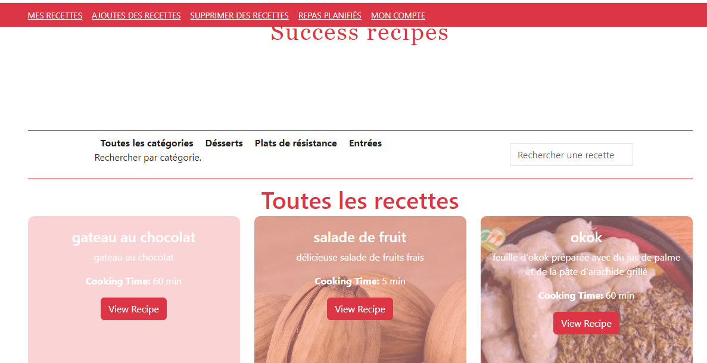
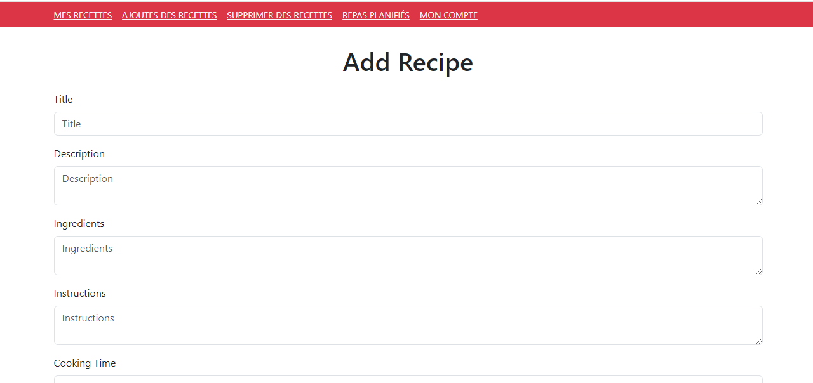
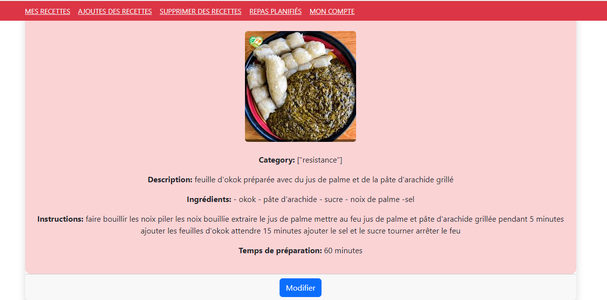
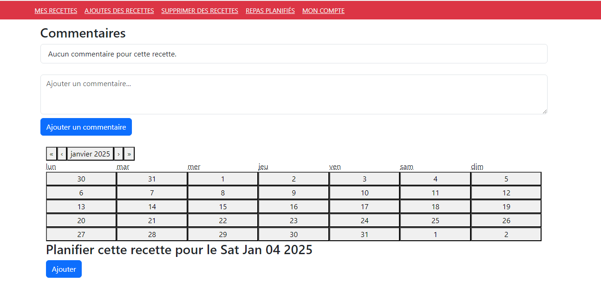
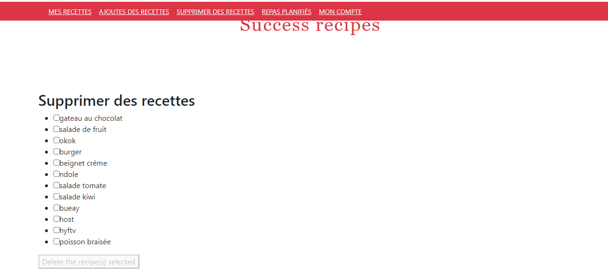

# Recipe App

Welcome to the Recipe App! This application is designed to help users organize, manage, and share their favorite recipes effortlessly. With features like recipe categorization, filtering, and an intuitive user interface, cooking has never been easier!

## Features

- **Add Recipes**: Easily add recipes with ingredients, steps, instructions, cooking time and images.
- **Delete/Modify Recipes** : Easily delete and modify recipes. 
- **Plan Recipes** : plan recipe on the recipe page. 
- **Add Comments** : add comment on the recipe page. 
- **Categorization**: Assign categories to recipes for better organization .
- **Filter Recipes**: Quickly find recipes based on their category.
- **Search Functionality**: Add a search bar for finding recipes by name or ingredients.








## Technologies Used

- **Frontend**: React.js
- **Backend**: Node.js with Express
- **Database**: MySql for storing recipe data
- **Styling**: CSS3 and Boostrap for a modern look
- **Tools**: VS Code, Git, and GitHub for development and version control

## Installation

1. Clone the repository:
   ```bash
   git clone https://github.com/yourusername/recipe-app.git
   ```
2. Navigate to the project directory:
   ```bash
   cd recipe-app
   ```
3. Install dependencies:
   ```bash
   npm install
   ```
4. Start the development server:
   ```bash
   npm start
   ```
5. Start node server:
   ```bash
   node server.js
   ```

## Usage

1. Open the app in your browser at `http://localhost:3000`.
2. Add your favorite recipes, categorize them, and explore!
3. Use the filters to find recipes by category and enjoy cooking.

## Future Improvements

- **User Authentication**: Allow users to create accounts and save their personalized recipe collections.
- **Social Sharing**: Share recipes with friends directly from the app.
- **Responsive Design**: Fully optimized for desktop, tablet, and mobile devices.
- **Favorites**: Enable users to mark and save their favorite recipes.

## Contributing

Contributions are welcome! If you would like to enhance the app or fix a bug:
1. Fork the repository.
2. Create a new branch (`feature/your-feature-name`).
3. Make your changes and commit them.
4. Open a pull request.

## License

This project is licensed under the [MIT License](LICENSE).

## Contact

If you have any questions or suggestions, feel free to reach out:
- **Email**: nyabengrlle@gmail.com
- **GitHub**: [laroche237](https://github.com/laroche237)
- **LinkedIn**: [Laroche](https://www.linkedin.com/in/rochelle-nyabeng-4658992a8/)

---

Happy cooking! 🍳
